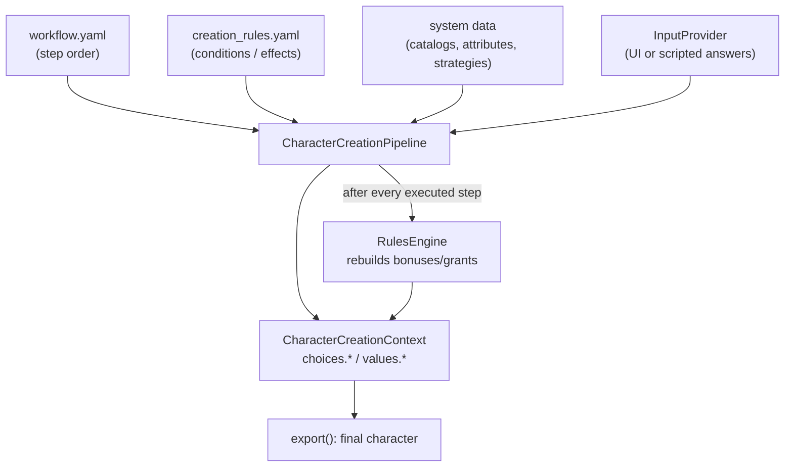

# Character Creation

**Companion4SoloPlayer** ships a generic, data-driven character creation
engine. Everything *game-system agnostic* lives in
`companion4soloplayer.core.creation`; everything *game-specific* (races,
classes, skills, spells, bonuses, strategies, step order) lives in each
plugin.

## Table of Contents

- [Overview](#overview)
- [State container](#state-container)
- [Steps](#steps)
- [Input providers](#input-providers)
- [Condition/Effect rules](#conditioneffect-rules)
- [Attribute generation strategies](#attribute-generation-strategies)
- [Pipeline](#pipeline)
- [Workflow configuration](#workflow-configuration)
- [Using the workflow from a plugin](#using-the-workflow-from-a-plugin)
- [Player creation dialog](#player-creation-dialog)

---

## Overview



The engine covers the functional requirements as follows:

| Requirement | Supported by |
| --- | --- |
| Race optional | `SelectionStep` with `optional: true`, or no step at all / no catalog |
| Class optional | same as race |
| Attributes: random **or** manual (all or part) | `AttributeGenerationStep` with `random` / `manual` / `mixed` modes |
| Skills: free / inherited / none | `SkillSelectionStep` with `free` / `inherited` / `none` modes |
| Bonuses & maluses (race, class, attributes, skills...) | Condition/Effect rules evaluated after each step |
| Identity (name, background) | `IdentityStep` |
| Spells: filtered choice **or** automatic | `SpellSelectionStep` with `choice` (filter) / `auto` (rules grant them) / `none` |
| Step order varies per system | `workflow.yaml` declares the ordered step list |

---

## State container

`CharacterCreationContext` holds two namespaces addressed by dotted
paths:

- **`choices.*`** — the raw choices of the player
  (`choices.identity.name`, `choices.race`, `choices.class`,
  `choices.skills`...);
- **`values.*`** — the values computed by the steps
  (`values.attributes.strength`, `values.skills`, `values.spells`...).

On top of the base values, the rules engine records *operations*
(bonuses, maluses, grants). `context.effective(path)` folds the base
value and its operations; `context.export()` returns the final
character (raw choices + effective values).

Operations are cleared and rebuilt at **every** evaluation, so a bonus
is never double counted whatever the number of evaluations:

```python
from companion4soloplayer.core.creation import CharacterCreationContext

context = CharacterCreationContext()
context.set("values.attributes.constitution", 12)
# ... after an evaluation recording "+2 constitution" ...
assert context.effective("values.attributes.constitution") == 14
assert context.get("values.attributes.constitution") == 12  # base untouched
```

---

## Steps

Every step subclasses `CreationStep` and implements three methods:

| Method | Role |
| --- | --- |
| `is_applicable(context)` | tells whether the step must run (missing catalog, `inherited`/`auto`/`none` modes...) |
| `execute(context, inputs)` | asks the answers through the `InputProvider` and writes the state |
| `validate(context)` | returns the list of error messages (empty = valid) |
| `describe_inputs(context)` | declares the data the step will ask (answer key, widget kind, options) |

The generic steps shipped by the core are:

| Step | Purpose | Key parameters |
| --- | --- | --- |
| `IdentityStep` | name + background | `background_options`, `name_required`, `background_required` |
| `SelectionStep` | one choice (race, class...) | `target`, `catalog` **or** `options`, `optional` |
| `AttributeGenerationStep` | base attribute values | `mode` (`random`/`manual`/`mixed`), `strategy`, `manual_attributes`, bounds |
| `SkillSelectionStep` | skill picks | `mode` (`free`/`inherited`/`none`), `catalog`, counts |
| `SpellSelectionStep` | spell picks | `mode` (`choice`/`auto`/`none`), `spell_filter`, counts |

A step that has nothing to do is **skipped**, which is how a game
system without races, spells or skills drops those requirements.

---

## Input providers

Steps never talk to a UI: they ask the session `InputProvider`.
`MappingInputProvider` replays pre-recorded answers (tests, scripts);
an interactive UI implements the same protocol with dialogs.

Answer keys are stable:

| Question | Key |
| --- | --- |
| Name | `identity.name` |
| Background | `identity.background` |
| Race / class / skills / spells | the `step_id` (`race`, `class`, `skills`, `spells`) |
| One attribute | `attributes.<name>` (e.g. `attributes.strength`) |

```python
from companion4soloplayer.core.creation import MappingInputProvider

inputs = MappingInputProvider({
    "identity.name": "Brom",
    "race": "Dwarf",
    "class": "Wizard",
    "skills": ["Diplomacy", "Medicine"],
    "spells": ["Rune Ward"],
})
```

---

## Condition/Effect rules

Rules express the bonuses and maluses of the game system. A rule is a
list of **conditions** (all must hold) gating a list of **effects**:

```yaml
# datas/creation_rules.yaml
rules:
  - id: dwarf_hardy
    description: Dwarves are hardy (+2 constitution).
    when:
      - target: choices.race
        operator: eq
        value: Dwarf
    effects:
      - target: values.attributes.constitution
        action: add
        value: 2
```

- **Condition** = *target + operator + value*. Operators: `eq`, `ne`,
  `gt`, `ge`, `lt`, `le`, `in`, `not_in`, `contains`, `not_contains`,
  `exists`, `not_exists`, `empty`, `not_empty`.
- **Effect** = *target + action + value*. Actions: `add`, `sub`, `mul`,
  `set`, `grant` (unique append), `remove`.

The `RulesEngine` is evaluated **after every executed step**, in
declaration order: a rule whose condition becomes true later (race
chosen, attributes rolled, skills picked...) is picked up at the next
evaluation, and later rules of the same pass see the effects of the
earlier ones (chaining).

---

## Attribute generation strategies

`AttributeGenerationStep` supports three modes:

- `random` — every attribute comes from a strategy, unless the provider
  already holds an answer for it (a die rolled in the Player dialog, a
  scripted fixture...), which keeps the UI and the final character in
  sync;
- `manual` — every attribute is asked to the player;
- `mixed` — the attributes listed in `manual_attributes` are asked, the
  others are rolled.

Strategies implement `AttributeGenerationStrategy.roll(attribute,
roller)`. The core ships `RollStrategy` (e.g. `"4d6", keep=3`) and
`ConstantStrategy`; plugins register their own named strategies in
`system["strategies"]` so `workflow.yaml` can reference them by name:

```yaml
params:
  mode: random
  strategy: classic_4d6      # FourSixKeepBestStrategy of the demo plugin
```

---

## Pipeline

`CharacterCreationPipeline.run(context, inputs)` processes the steps in
order and returns a `CreationReport`:

- `report.ok` — no step failed;
- `report.completed` — every declared step was processed;
- `report.results` — per-step status (`executed` / `skipped` / `failed`)
  and error messages;
- `report.rules_fired` — identifiers of the rules that fired (unique).

Input and configuration errors fail the step instead of crashing the
run; the pipeline stops on the first failure by default
(`stop_on_error=False` continues).

---

## Workflow configuration

The **order of the steps is data**: each game system declares it in its
own `workflow.yaml`, as `!pyclass` references (the same security model
as `rules.yaml`: parsing never imports anything, absolute references go
through a module allow-list, `local:` references resolve inside the
plugin package):

```yaml
# plugins/demo_plugin/datas/workflow.yaml
steps:
  - !pyclass
    path: companion4soloplayer.core.creation:IdentityStep
    params:
      step_id: identity
  - !pyclass
    path: companion4soloplayer.core.creation:SelectionStep
    params:
      step_id: race
      target: choices.race
      catalog: races
      optional: true
  # ... attributes, skills, spells ...
  - !pyclass
    path: companion4soloplayer.core.creation:SpellSelectionStep
    params:
      step_id: spells
      mode: choice
      spell_filter: !pyclass local:spell_available
```

`build_workflow()` / `build_workflow_from_yaml()` turn the document into
a pipeline; parameters that are themselves `!pyclass` references (such
as the spell filter) are resolved to the object they point at.

---

## Using the workflow from a plugin

The demo plugin exposes the assembled pipeline through the
`GamePlugin` contract:

```python
from companion4soloplayer.core.creation import MappingInputProvider
from companion4soloplayer.plugins.demo_plugin import Plugin

plugin = Plugin()
pipeline = plugin.create_character_creation()   # cached, stateless

context = pipeline.create_context()
report = pipeline.run(context, inputs)
if report.ok:
    character = context.export()
```

The plugin declares, under `plugins/demo_plugin/`:

- `datas/workflow.yaml` — step order and step parameters;
- `datas/creation_rules.yaml` — bonuses/maluses (race, class,
  attribute values, other skills);
- `datas/races.yaml`, `datas/skills.yaml`, `datas/spells.yaml` — the
  catalogs read through `system`;
- `creation/strategies.py` — the named generation methods;
- `creation/filters.py` — the spell availability filter;
- `creation/workflow.py` — the assembly (catalogs + rules + workflow).

---

## Player creation dialog

The **Manage > Player** menu (right above *Manage > Plugins*) opens the
dynamic creation dialog. The dialog belongs to the **application**
(`companion4soloplayer.ui.builder`), not to the plugins: any game
system exposing a creation pipeline through the `GamePlugin` contract
gets the same form, built from its `workflow.yaml` step order.

```mermaid
flowchart TD
    W["workflow.yaml (plugin)"] --> P["CharacterCreationPipeline"]
    P -->|describe_inputs() per step| B["CharacterCreationDialogBuilder"]
    B --> D["CharacterCreationDialog<br/>sections of empty widgets"]
    D -->|Validate| R["pipeline.run(collected answers)"]
    R -->|ok| OK["accepted: report + context"]
    R -->|failure| KO["errors displayed, dialog stays open"]
```

- The **sections, the field count and their widget kinds** come from
  the steps declared by `workflow.yaml`, through
  `CreationStep.describe_inputs(context)`: one section (group box) per
  step describing data; steps asking nothing (`inherited` skills,
  `auto` spells...) are not rendered.
- Each data item renders a widget matching its `InputKind`:

  | Kind | Widget | Example |
  | --- | --- | --- |
  | `TEXT` | single-line text edit | character name |
  | `NUMBER` | single-line numeric edit | manually assigned attribute |
  | `DICE` | label + die button | randomly generated attribute |
  | `CHOICE` | single-selection list | race, class |
  | `CHOICES` | multiple-selection list | skills, spells |

- Every widget starts **empty**.
- **Validate** collects the answers (empty widgets stay unanswered, so
  the steps keep enforcing their own required/optional rules), runs the
  pipeline and closes the dialog on success — `dialog.report` holds the
  `CreationReport`, `dialog.context` the filled state. On failure the
  step error messages are displayed and the dialog stays open.
- **Cancel** discards everything (`report` and `context` stay `None`).
- The choice lists are **re-evaluated** whenever a selection or a die
  roll changes: the pipeline is replayed on a throwaway context with
  the answers collected so far (`stop_on_error=False`), so a filtered
  list — the spells restricted to the chosen class, for instance —
  always matches the state known so far.

```python
from companion4soloplayer.ui.builder import CharacterCreationDialog

dialog = CharacterCreationDialog(plugin.create_character_creation(), parent)
if dialog.exec():
    character = dialog.context.export()
```
