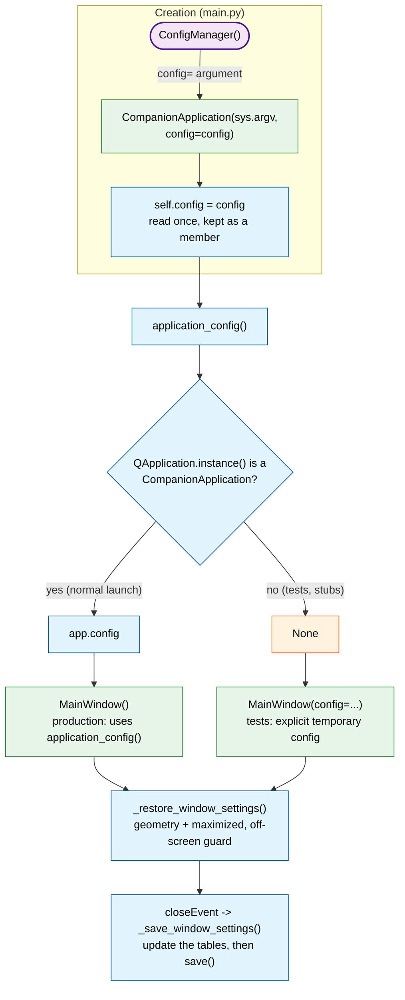
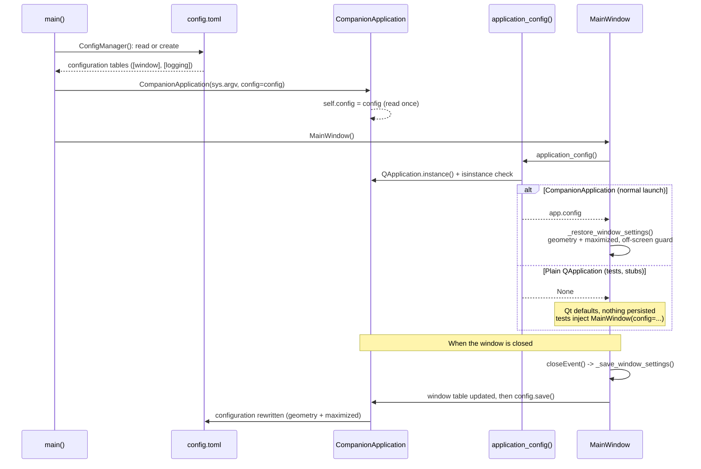

# Application class

`app/application.py` defines `CompanionApplication`, the `QApplication`
subclass carrying the `ConfigManager` shared by every component of the
application, and `application_config()`, the accessor used to reach that
configuration from anywhere.

## Shared configuration flow

The configuration is read **once**, in `main()`, and travels through the
application as a member: every component sees the same instance.
`application_config()` returns `None` outside a normal launch (tests,
stubs), so components tolerate a missing configuration: the main window
then keeps the Qt defaults and persists nothing. Tests inject their own
`ConfigManager` (temporary folder) instead of relying on the global state.

## Sequence diagram

The same mechanism over time, including the two access paths (production
and tests) and the save performed when the window is closed.

## API reference

::: app.application
    options:
      heading_level: 3
