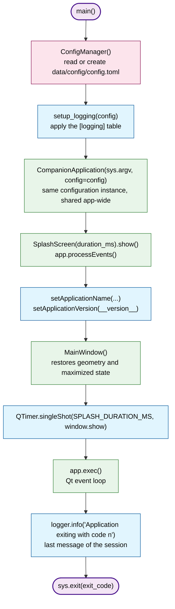
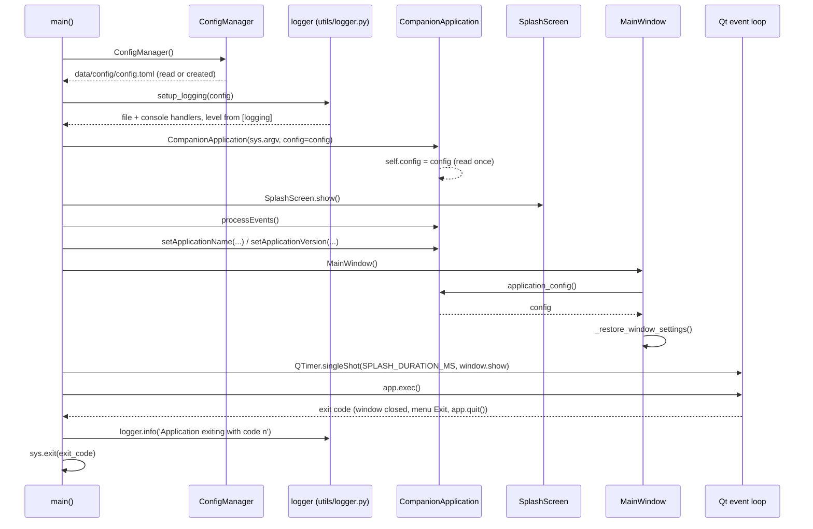

# Main entry point

`main()` bootstraps the application: it reads the configuration file,
configures the logging, builds the Qt application and the main window,
then runs the event loop until the application is closed.

## Startup and shutdown flow

The order is strict: the logger needs the configuration, and both must be
ready before the first Qt object is created. The last message is written
once `app.exec()` returns, i.e. for **every** way of leaving the
application (window closed, *File > Exit*, `app.quit()`). When logging is
disabled (`enabled = false`), that message is blocked like any other
record.

## Sequence diagram

The same flow seen as interactions between the modules: the configuration
is read first, the logging is configured from it, then the Qt objects are
created and the event loop takes over until the exit message is written.

## API reference

::: main
    options:
      heading_level: 3
