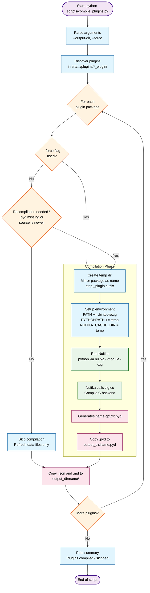
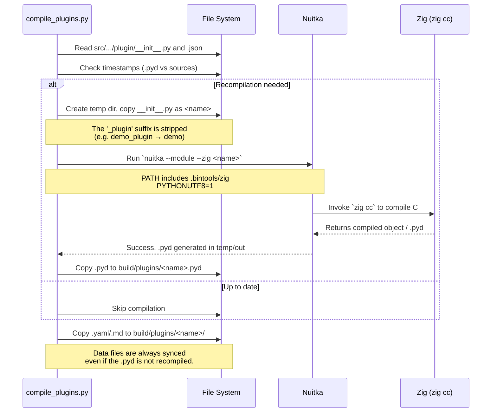

# Plugin Compilation

This page describes how Companion4SoloPlayer compiles game plugins into
extension modules (`.pyd`) using Nuitka and the Zig compiler.

## Overview

Each plugin package under `src/companion4soloplayer/plugins` is compiled
with Nuitka (module mode) into a standalone extension library. The C
compilation backend is the Zig compiler shipped in `.bintools/`.

```
demo_plugin           ->  build/plugins/demo.pyd
```

**Toolchain:** Python → Nuitka (`--module --zig`) → `zig cc` (clang).

## Process Flow

The script `scripts/compile_plugins.py` orchestrates the entire build.
Plugins are recompiled only when needed: if any source file (`__init__.py`
or data file) is newer than the compiled `.pyd`, the plugin is rebuilt;
otherwise the existing library is kept. Pass `--force` to rebuild every
plugin regardless of timestamps.



## Compilation Toolchain

The following sequence diagram details how the script interacts with the
file system, Nuitka, and the Zig compiler during the actual compilation
of a single plugin.



## Output Layout

The YAML data files of each plugin are copied into
`build/plugins/<plugin_name>/` next to the compiled library, so the
released application layout is:

```
internal/plugins/
    demo.pyd
    demo/
        plugin.yaml, classes.yaml, ...
        ...
```

## Usage

```bash
python scripts/compile_plugins.py [--output-dir build/plugins] [--force]
```

| Argument | Default | Description |
|---|---|---|
| `--output-dir` | `build/plugins` | Directory receiving the compiled plugins |
| `--force` | *(off)* | Recompile every plugin, ignoring timestamps |

## API Reference

::: compile_plugins
