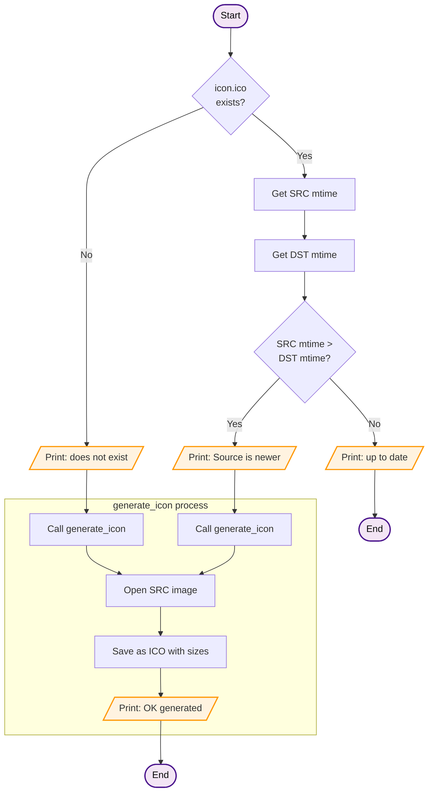
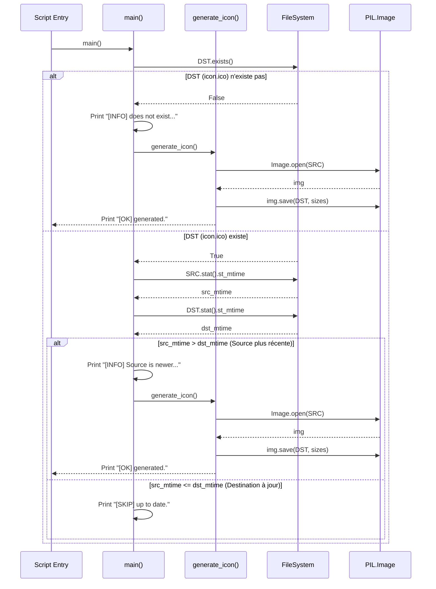

# Icon generation

This page describes how Companion4SoloPlayer generate icon.

## Process Flow

```mermaid
flowchart TD
    Start([Start]) --> CheckExists{icon.ico<br/>exists?}
    
    CheckExists -- No --> InfoNotExist[/Print: does not exist/]
    InfoNotExist --> CallGen1
    
    CheckExists -- Yes --> GetSrcMtime[Get SRC mtime]
    GetSrcMtime --> GetDstMtime[Get DST mtime]
    GetDstMtime --> CheckMtime{SRC mtime ><br/>DST mtime?}
    
    CheckMtime -- Yes --> InfoNewer[/Print: Source is newer/]
    InfoNewer --> CallGen2
    
    CheckMtime -- No --> InfoSkip[/Print: up to date/]
    InfoSkip --> EndSkip([End])
    
    subgraph generate_icon process
        CallGen1[Call generate_icon] --> OpenImg[Open SRC image]
        CallGen2[Call generate_icon] --> OpenImg
        OpenImg --> SaveImg[Save as ICO with sizes]
        SaveImg --> PrintOK[/Print: OK generated/]
    end
    
    PrintOK --> EndGen([End])

    %% Defining the style for print blocks, start/end blocks
    classDef printStyle fill:#FFF3E0,stroke:#FF9800,stroke-width:2px,color:#333
    classDef startEnd fill:#f3e5f5,stroke:#4a148c,stroke-width:2px,color:#000
    
    %% Applying styles to print nodes
    class InfoNotExist,InfoNewer,InfoSkip,PrintOK printStyle
    class Start,EndSkip,EndGen startEnd
```

## Sequence diagram

```mermaid
sequenceDiagram
    participant User as Script Entry
    participant Main as main()
    participant Gen as generate_icon()
    participant FS as FileSystem
    participant PIL as PIL.Image

    User->>Main: main()
    Main->>FS: DST.exists()
    
    alt DST (icon.ico) n'existe pas
        FS-->>Main: False
        Main->>Main: Print "[INFO] does not exist..."
        Main->>Gen: generate_icon()
        Gen->>PIL: Image.open(SRC)
        PIL-->>Gen: img
        Gen->>PIL: img.save(DST, sizes)
        Gen-->>User: Print "[OK] generated."
        
    else DST (icon.ico) existe
        FS-->>Main: True
        Main->>FS: SRC.stat().st_mtime
        FS-->>Main: src_mtime
        Main->>FS: DST.stat().st_mtime
        FS-->>Main: dst_mtime
        
        alt src_mtime > dst_mtime (Source plus récente)
            Main->>Main: Print "[INFO] Source is newer..."
            Main->>Gen: generate_icon()
            Gen->>PIL: Image.open(SRC)
            PIL-->>Gen: img
            Gen->>PIL: img.save(DST, sizes)
            Gen-->>User: Print "[OK] generated."
            
        else src_mtime <= dst_mtime (Destination à jour)
            Main->>Main: Print "[SKIP] up to date."
        end
    end
```

## API Reference
::: make_icon